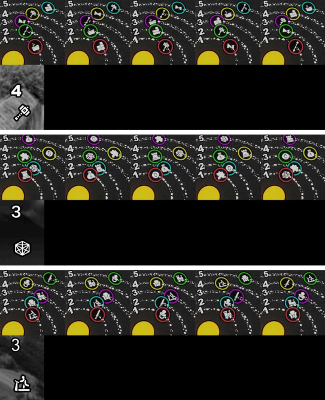

# Neural CAPTCHA Solver

## Description
This project involves solving a set of CAPTCHAs using a neural network model. Each CAPTCHA consists of a group of images, among which the correct answer must be selected, and a hint image, in which the answer is encrypted.

## Task
On each of the answer options, icons are depicted, located on numbered orbits. There are a total of 5 orbits. The correct answer is the image on which the icon from the hint image is located on the orbit with the number indicated on the hint image.

## Training Data
The training data contains 970 CAPTCHAs with markup in the labelme format.

## Target Metric
The target metric is the accuracy of the predicted answers. The final accuracy measurement will be made on a closed selection of images, which may contain icons not represented in the training sample.

## Estimated Time of Completion
The estimated time to complete the task is 5-7 days.

## Getting Started
To get started with the project, follow the steps below:

1. Clone the repository to your local machine.
2. Install the necessary libraries and dependencies by running `pip install -r requirements.txt` in your terminal.
3. Once the installation is complete, you can launch the project by running `python main.py` in your terminal.